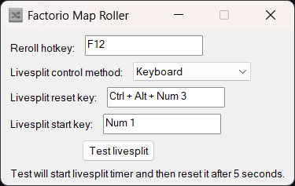

# Factorio Map Roller

A small script for rerolling maps and starting Livesplit in Factorio random seed speedruns.

Instead of using a static location for the reroll button it has a simple system to find the button automatically. This allows it to adjust for any UI scale and screen resolution. While also stopping accidentally triggering, and resetting Liveplit, while outside of the map preview.

Has the ability to control Livesplit with either hotkeys or TCP network connection.

## Usage

### Initial Setup

1. Download the MapRoll script to a conventient location.
   - The `.exe` executable can be used on its own.
   - The source `.ahk` script file requires AutoHotkey v2 installed to run it.
2. Launch the script for the first time.
3. Configure the Livesplit control method and reroll hotkey (see below for details).
4. Start your map rolling quest for that perfect map (or maybe just a moderately acceptable one).

### Configuring Reroll Hotkey

1. The default reroll hotkey is F12.
2. To change the reroll hotkey:
   - Click on the hotkey field in the MapRoll interface.
   - Press the desired key or key combination.
   - The new hotkey will be set automatically.

### Configuring Livesplit Control

There are two methods to control Livesplit: Keyboard and TCP.

#### Keyboard Control

1. In the MapRoll interface, select the Keyboard control method.
2. Set two hotkeys:
   - One for resetting Livesplit
   - One for starting Livesplit
3. Click on each field and press the desired key or key combination.

#### TCP Control

1. In the MapRoll interface, select the TCP control method.
2. Enter the IP address where Livesplit is running:
   - Use `127.0.0.1` if Livesplit is on the same computer.
3. Enter the port number Livesplit is using for TCP connections. This defaults
   to `16834` in Livesplit.
4. Note: As of Livesplit version 1.8.29, you need to start the TCP server each time you launch Livesplit.

### Testing Livesplit Connection

1. After configuring Livesplit control, use the "Test livesplit" button in the MapRoll interface.
2. This button will start the Livesplit timer and then reset it after 5 seconds.
3. Use this to easily verify that your Livesplit control is set up correctly.

### Using MapRoll

1. Run MapRoll and Livesplit.
2. Start Factorio and navigate to the map preview screen.
3. Use the configured reroll hotkey (default F12) to generate a new map and reset Livesplit.
4. When you're satisfied with the map, start your speedrun.

### Tips

- The automatic button detection helps guard against triggering accidental resets when outside the map preview screen.
- You can combine a hotkey with Ctrl, Alt, or Shift for more complex key combinations. You might particularly want to do this for the Livesplit reset hotkey to help prevent accidental resets.
- Use the "Test livesplit" button whenever you make changes to your Livesplit configuration to ensure everything is working correctly.
